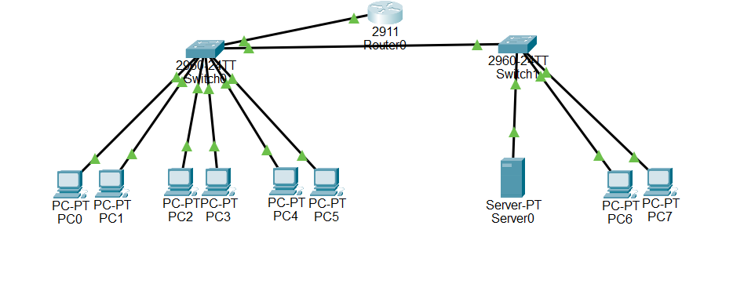

# Small Business VLAN Network

## Project Overview

Designed and configured a simulated small business network using Cisco 2911 routers and Catalyst 2960 switches.

The network uses VLAN segmentation to separate Management, Sales, IT, and Guest departments while providing controlled inter-VLAN communication.

## Network Topology



## Technologies Used

* Cisco Packet Tracer
* Cisco 2911 Router
* Cisco Catalyst 2960 Switch
* VLANs
* 802.1Q Trunking
* Router-on-a-Stick
* Inter-VLAN Routing
* IPv4 Addressing
* DHCP
* ICMP

## VLAN Design

| VLAN | Department |
| ---- | ---------- |
| 10   | Management |
| 20   | Sales      |
| 30   | IT         |
| 40   | Guest      |

## Configuration

Configured 802.1Q trunking between the switch and router.

Implemented Router-on-a-Stick using router subinterfaces to provide inter-VLAN routing.

Configured DHCP pools on the router to automatically assign:

* IPv4 addresses
* Default gateways
* DNS information

## Troubleshooting

Identified and corrected VLAN assignment and connectivity issues.

Used structured troubleshooting to verify:

1. VLAN membership
2. Access-port configuration
3. Trunk configuration
4. Router subinterfaces
5. IP addressing
6. DHCP operation
7. End-to-end connectivity

## Verification Commands

```text
show vlan brief
show interfaces trunk
show ip interface brief
show ip dhcp binding
ping
ipconfig
```

## Skills Demonstrated

* Network segmentation
* VLAN configuration
* Inter-VLAN routing
* DHCP configuration
* Cisco IOS
* Network troubleshooting
* Connectivity verification
* Technical documentation
